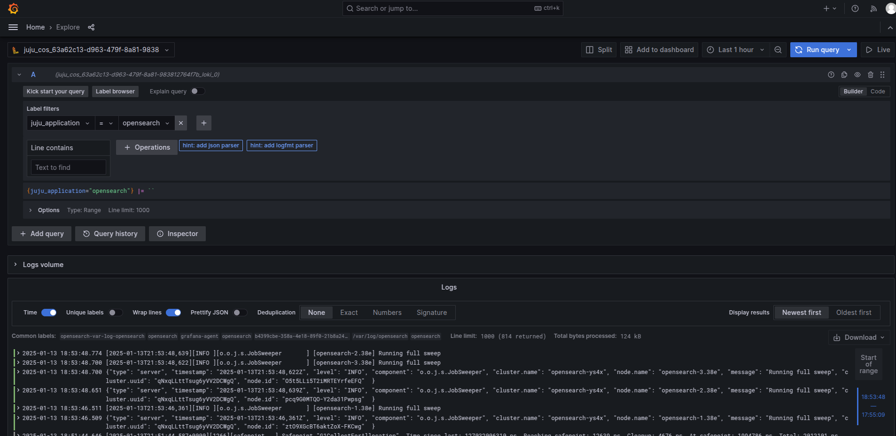
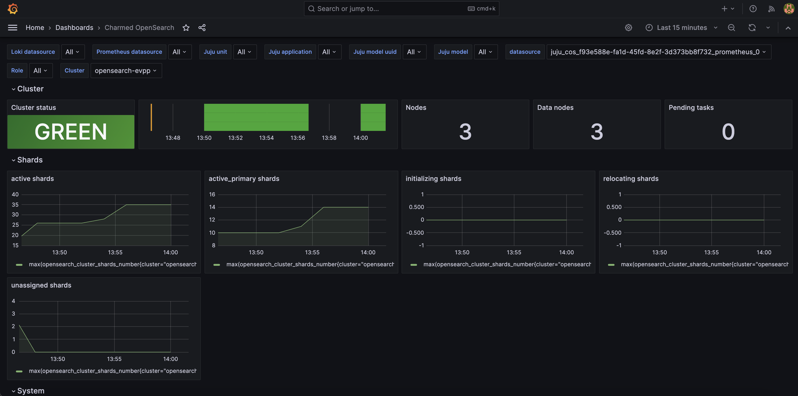
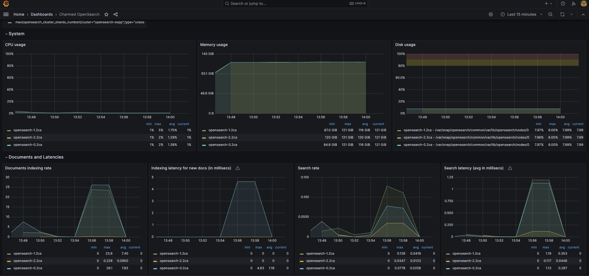

(explanation-monitoring)=

# Monitoring

The OpenSearch charm integrates with the Canonical Observability Stack (COS) to provide infrastructure and cluster
health monitoring through metrics, dashboards, alert rules, and logs. COS uses Prometheus for metrics collection,
Grafana for visualization, Loki for log aggregation, and Alertmanager for alerting. This enables monitoring of
OpenSearch cluster performance, resource utilization (CPU, memory, disk I/O), cluster statistics (node health, shard
allocation, indexing rates), and operational health.

The way telemetry reaches COS depends on the charm variant:

- On **VMs**, the `opensearch` machine charm exposes a `cos-agent` endpoint, and a machine `grafana-agent` charm
  collects the telemetry and forwards it to the COS applications (which typically run in a separate Kubernetes model).
- On **Kubernetes**, the `opensearch-k8s` charm exposes native COS endpoints (`metrics-endpoint`, `grafana-dashboard`,
  and `logging`). When COS runs in a separate model, an `opentelemetry-collector-k8s` charm in the OpenSearch model
  forwards the telemetry to COS. When COS runs in the same model, OpenSearch integrates directly with the Prometheus,
  Grafana, and Loki applications.

```{note}
See: [How to enable monitoring](how-to-monitoring) via COS and Grafana.
```

Additionally, Charmed OpenSearch can integrate with the
[OpenSearch Dashboards](https://canonical-charmed-opensearch-dashboards.readthedocs-hosted.com/2/) charm for exploring
and visualizing your indexed business or application data. While COS with Grafana monitors your OpenSearch
infrastructure and operational health, OpenSearch Dashboards provides purpose-built tools for interactive data
exploration, custom visualizations, query builders, and OpenSearch-specific features like anomaly detection. Most
production deployments benefit from using both: COS for infrastructure monitoring and OpenSearch Dashboards for data
analysis.

```{note}
See: [How to deploy OpenSearch Dashboards](https://canonical-charmed-opensearch-dashboards.readthedocs-hosted.com/2/how-to/deploy/) charm.
```

## Metrics

The charm enables the Prometheus Exporter plugin for OpenSearch by default:
[The Prometheus Exporter Plugin for OpenSearch](https://github.com/Aiven-Open/prometheus-exporter-plugin-for-opensearch)

The meaning of the metrics collected can be found in the upstream documentation:

- [{spellexception}`indices_stats_metrics`](https://opensearch.org/docs/2.19/api-reference/index-apis/stats/)
- [{spellexception}`nodes_stats_metrics`](https://opensearch.org/docs/2.19/api-reference/nodes-apis/nodes-stats/)
- [{spellexception}`cluster_stats_metrics`](https://opensearch.org/docs/2.19/api-reference/cluster-api/cluster-stats/)

## Alert rules

The charm deploys a pre-configured set of Prometheus alert rules by default.

To ensure you are referencing the latest default alert rules, check the source file of alert definitions in the
repository:

- VM:
  [machine prometheus_alerts.yaml](https://github.com/canonical/opensearch-operator/blob/2/edge/machine/src/alert_rules/prometheus/prometheus_alerts.yaml)
- K8s:
  [kubernetes prometheus_alerts.yaml](https://github.com/canonical/opensearch-operator/blob/2/edge/kubernetes/src/alert_rules/prometheus/prometheus_alerts.yaml)

The K8s charm additionally ships a set of Loki log-based alert rules, see
[opensearch.rules](https://github.com/canonical/opensearch-operator/blob/2/edge/kubernetes/src/loki_alert_rules/opensearch.rules).

## Logs

All the logs from the OpenSearch payload are available in the Grafana GUI at `Home > Explore`

To get OpenSearch logs, go to the `Label filters` field and set `juju_application` to the name of your OpenSearch
application (for example, `opensearch` on VMs or `opensearch-k8s` on Kubernetes), select one operation, e.g.
`Line contains` and run the query.

The following Grafana Explore screenshot shows OpenSearch logs from a VM deployment:



## Grafana dashboard

The **Charmed OpenSearch** Grafana dashboard provides an at-a-glance view of cluster health, node resource utilization,
and indexing throughput. The dashboard includes panels for CPU, memory, disk I/O, JVM heap, shard counts, and document
indexing rates.

You can filter the displayed data using the selectors at the top of the dashboard:

- **Juju model** — the Juju model the cluster is deployed in
- **Juju application** — the Juju application (e.g. `opensearch` or `opensearch-main`)
- **Juju unit** — an individual Juju unit within the application
- **Cluster** — the OpenSearch cluster name (useful when multiple clusters share a COS instance)
- **Role** — filter by OpenSearch node role (e.g. `cluster_manager`, `data`)




