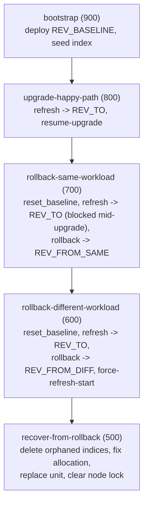

# Upgrade guide end-to-end tests

This directory contains the end-to-end test harness for
[`docs/how-to/upgrade.md`](../../../docs/how-to/upgrade.md). It uses the same
approach as the tutorial tests (`tests/tutorial/`): shell commands are
extracted from the Markdown guide and executed as Spread tasks inside a
Multipass VM.

## 0. Running the tests

### Manually

From the project root:

```bash
tox -e guide-upgrade            # full suite via Spread (requires Multipass + Spread)
tox -e guide-upgrade-extract    # only regenerate the task scripts
```

Or directly:

```bash
make -f tests/guides/upgrade/Makefile test          # abort on first failure
make -f tests/guides/upgrade/Makefile test-continue # run all tasks even if some fail
make -f tests/guides/upgrade/Makefile test-debug    # drop into a shell on failure
```

Both entry points run `extract_guide_tasks.py` first to regenerate `tasks/`
from the current `docs/how-to/upgrade.md`, then invoke Spread. Requires
`multipass` and `spread` (`go install github.com/canonical/spread/cmd/spread`)
on `$PATH`.

### Via CI

[`.github/workflows/upgrade-guide-tests.yaml`](../../../.github/workflows/upgrade-guide-tests.yaml)
runs the full suite on a self-hosted runner (`multipass` + `spread` installed
on the fly). Triggers:

- `schedule`: monthly, on the 15th at 03:00 UTC
- `workflow_dispatch`: manual run from the Actions tab
- `workflow_call`: so other workflows can invoke it

## 1. Test scenarios (task path)

Tasks live in the single `tasks/` Spread suite (mirroring the tutorial
layout) and run **sequentially in one VM**, ordered by descending priority.
`bootstrap.sh` + `bootstrap/task.yaml` are hand-written and tracked in git;
the other four are generated from the guide by `extract_guide_tasks.py` into
`tasks/` (gitignored). Teardown is implicit: Spread's `discard` phase purges
the whole Multipass VM (`opensearch-upgrade-vm`).

| Task | Priority | Covers |
| ---- | -------- | ------ |
| `bootstrap` (hand-written) | 900 | Environment setup, revision resolution, baseline deployment, seed index |
| `upgrade-happy-path` | 800 | Scale-up, `pre-upgrade-check`, `juju refresh`, `resume-upgrade`, scale-back, health check |
| `rollback-same-workload` | 700 | Mid-upgrade rollback to a revision with the same workload version |
| `rollback-different-workload` | 600 | Rollback to a different workload version, `force-refresh-start check-compatibility=false` |
| `recover-from-rollback` | 500 | Orphaned index deletion, allocation settings, unit replacement, node-lock removal |



`rollback-same-workload` and `rollback-different-workload` each start by
calling `reset_baseline` (in `helpers.sh`): OpenSearch cannot downgrade its
workload, so refreshing back to an older revision *after* an upgrade leaves
the cluster in an undefined state. `reset_baseline` destroys and recreates
the `upgrade` Juju model instead of trying to "undo" a previous task's
changes, so each rollback scenario starts clean. `recover-from-rollback` is
the exception — it deliberately continues from the broken state left by
`rollback-different-workload`, since that is the scenario the guide's
recovery steps are meant to fix.

Task boundaries are declared in the guide's existing `<!-- test:spread ... -->`
metadata block at the top of `docs/how-to/upgrade.md` — no extra inline
markers and no page split:

```text
<!-- test:spread
kill-timeout: 90m
tasks:
  - name: upgrade-happy-path
    from: how-to-minor-upgrade        # MyST anchor or heading text
    to:   how-to-minor-rollback
    priority: 800
-->
```

`extract_guide_tasks.py` slices the guide at those `from`/`to` anchors, emits
one shell script per task into `tasks/`, plus a `task.yaml` for Spread. If an
anchor no longer resolves (e.g. a heading was renamed), extraction fails
loudly instead of silently skipping content.

## 2. Choosing revisions

`resolve_revisions.py` runs once, at `bootstrap` time, and writes
`/root/revisions.env` (`REV_TO`, `REV_BASELINE`, `REV_FROM_SAME`,
`REV_FROM_DIFF`, `DEPLOY_BASE`), which every later task sources.

The Charmhub API exposes the current `channel-map` (revision numbers
released per channel/base) but **not** the OpenSearch workload version each
revision runs — only the charm revision number. Since the upgrade state
machine only triggers on a *workload* version change (a charm-only refresh
completes silently, without a `blocked` step), the resolver needs to know
workload versions too. It combines a live API call with a small curated map
kept in the script:

1. Fetch the `2/stable` channel-map from Charmhub (amd64 only).
2. For each base, preferred first (`ubuntu@24.04`, then `ubuntu@22.04`):
   a. `REV_TO` = latest revision released on `2/stable` for that base.
   b. Look up `REV_TO`'s workload version in the curated
      `REVISION_WORKLOAD_MAP`. If unknown, try the next base.
   c. `REV_BASELINE` = highest revision below `REV_TO`, same base, with a
      **different** workload version than `REV_TO` (this guarantees the
      upgrade actually goes through the `blocked` → `resume-upgrade` state
      machine instead of completing as a silent charm-only refresh).
   d. `REV_FROM_SAME` = highest revision below `REV_TO`, same base, with
      the **same** workload version as `REV_TO` (used by
      `rollback-same-workload`). Both rollback targets are relative to
      `REV_TO`'s workload, not the baseline's: a rollback happens
      mid-upgrade, when the highest unit already runs `REV_TO`'s workload,
      so a baseline-workload target would be a workload downgrade for that
      unit — which OpenSearch refuses, leaving it permanently stuck.
   e. `REV_FROM_DIFF` = highest revision below `REV_TO`, same base,
      with an **older** workload version than `REV_TO` (used by
      `rollback-different-workload` and to build the broken state for
      `recover-from-rollback`). If none exists, `REV_FROM_DIFF` is left
      **empty** and both tasks **skip with a clear message** instead of
      silently degrading to a same-workload rollback (which can never
      produce the documented `Rollback incompatible` state).
3. If no base yields a complete set, fall back to the hardcoded
   `PINNED_FALLBACK` dict and print a loud warning — this means
   `REVISION_WORKLOAD_MAP` is stale and needs a new entry added.

All four revisions in a resolved set are always on the **same base** —
Juju refuses to refresh a charm across bases ("cannot upgrade from single
base ubuntu@24.04 to a charm supporting ubuntu@22.04"), so mixing bases
within one run is not possible.

As of the last update, this resolves to (no fallback warning):

```text
REV_BASELINE=299   REV_TO=344   REV_FROM_SAME=342   REV_FROM_DIFF=299   DEPLOY_BASE=ubuntu@24.04
```

(With the `REV_TO`-relative semantics, `REV_FROM_DIFF` is now non-empty on
this base: 299 ships an older workload (2.19.2) than `REV_TO` 344
(2.19.4), so the different-workload rollback and recovery scenarios
actually run instead of skipping.)

### Known revisions (`REVISION_WORKLOAD_MAP`)

Verified manually by downloading each revision (`juju download opensearch
--revision N`) and reading its `manifest.yaml` (base) and `workload_version`
file. Refresh this table — and the map in `resolve_revisions.py` — when the
charm releases new revisions.

| Revision | Workload version | Base | Notes |
| -------- | ----------------- | ---- | ----- |
| 168 | 2.17.0 | ubuntu@22.04 | Sept 2024 |
| 295 | 2.19.2 | ubuntu@24.04 | |
| 297 | 2.19.2 | ubuntu@24.04 | |
| 299 | 2.19.2 | ubuntu@24.04 | highest 24.04 rev with the older workload version |
| 315 | 2.19.4 | ubuntu@22.04 | Ubuntu 24.04 support, OAuth/JWT, per [release notes](../../../docs/reference/release-notes/revision-315.md) |
| 342 | 2.19.4 | ubuntu@24.04 | |
| 344 | 2.19.4 | ubuntu@24.04 | Apr 2026, `2/stable` |
| 345 | 2.19.4 | ubuntu@22.04 | Apr 2026, `2/stable` |
| 360 | 2.19.4 | ubuntu@24.04 | Aug 2026, `2/edge` |

This table intentionally only lists revisions actually referenced by
`REVISION_WORKLOAD_MAP` in `resolve_revisions.py` — treat that dict as the
source of truth and this table as its human-readable mirror.

## 3. Helpers (`helpers.sh`)

Shared bash functions sourced by every task script (`bootstrap.sh` and the
four generated task scripts). 

`*` marks functions added for this guide's
tests that don't exist in the tutorial harness (`tests/tutorial/helpers.sh`):

| Function | Purpose |
| -------- | ------- |
| `wait_idle` | Poll until every Juju unit is `active`/`idle` (`--allow-blocked` for expected blocked apps) |
| `retry_until_success` | Retry a command on a fixed interval until it succeeds or times out |
| `current_revision APP` * | Read `charm-rev` for `APP` from `juju status --format=json` |
| `wait_app_status APP STATUS` * | Poll until the application's workload status equals `STATUS` |
| `wait_unit_message UNIT REGEX` * | Poll until a unit's workload-status message matches `REGEX` |
| `juju_refresh APP REV` * | `juju refresh` with retry — tolerates the transient `deploy incomplete, please try refresh again` error |
| `wait_highest_unit_upgraded [VER]` * | Poll until the highest-ordinal unit has actually finished its workload upgrade (active/idle, message reports a running version, no `(outdated)` marker); with `VER`, require that exact version |
| `juju_run_action UNIT ACTION` * | Run a Juju action and fail the task when the action itself fails |
| `clear_node_lock` * | Delete the `.charm_node_lock` document if a departed unit still holds it (tolerates 404) |
| `save_ca_and_password` * | Run `get-password`, parse the (Juju-version-dependent) JSON shape via a recursive key search, write `cert.pem`, export `OS_PASSWORD`/`OS_UNIT_IP` |
| `reset_baseline` * | Destroy and recreate the `upgrade` model, redeploy `REV_BASELINE` + TLS, seed a test index — used by both rollback tasks (see [scenario notes](#1-test-scenarios-task-path) above) |
| `cluster_health [STATUS]` * | Query `_cluster/health`; with `STATUS`, poll until that status is reached |

## 4. Other notes

- **Annotations** in the guide are HTML comments and never render in the
  published docs. 
  
  `*` marks annotations added for this guide's extractor
  (`extract_guide_tasks.py`) that the tutorial extractor
  (`tests/tutorial/extract_commands.py`) doesn't support:

  | Annotation | Purpose |
  | ---------- | ------- |
  | `<!-- test:spread ... -->` | Task metadata + `tasks:` partition list |
  | `<!-- test:vars ... -->` * | Map placeholders (`<target-revision>`) to literals or `${VAR}` references |
  | `<!-- test:setup ... -->` * | Hidden commands emitted before the task body (state resets) |
  | `<!-- test:teardown ... -->` * | Hidden commands emitted after the task body |
  | `<!-- test:run ... -->` | Hidden commands emitted inline |
  | `<!-- test:assert ... -->` | Hidden assertion commands (fail the task on non-zero exit) |
  | `<!-- test:await-idle ... -->` | Wait for all Juju units to settle |
  | `<!-- test:skip -->` | Skip the next ` ```shell ` block (e.g. local `.charm` file paths) |
  | `<!-- test:wait --seconds N -->` | Plain sleep |
  | `<!-- test:retry ... -->` | Retry a command until success |

- **Order matters inside a task.** Hidden `test:run`/`test:assert` blocks are
  emitted in document order, interleaved with the visible ` ```shell ` blocks
  they annotate. If a hidden block needs to run *before* a visible command
  (e.g. starting an upgrade before a rollback command can do anything
  useful), it must be placed above that command in the Markdown — the
  extractor does not reorder anything.
- **The guide stays generic.** Concrete values (revisions, unit IPs,
  passwords) never appear literally in the guide; they're injected through
  `test:vars` and hidden `test:run` blocks referencing shell variables
  (`$REV_TO`, `$OS_UNIT_IP`, etc.) set by `resolve_revisions.py` or
  `save_ca_and_password`.
- **Regenerating fails loudly on drift.** If a task's `from`/`to` anchor in
  the `test:spread` block no longer resolves (e.g. a heading was renamed),
  `extract_guide_tasks.py` errors out instead of silently skipping content.
